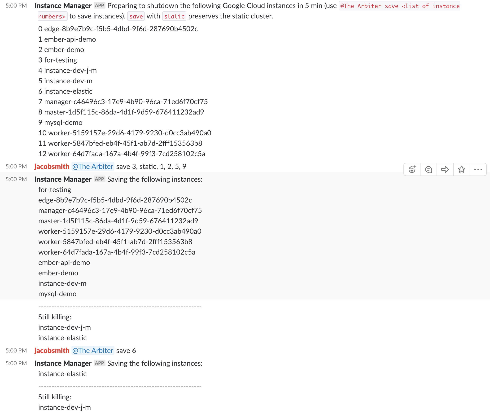

# GCE Instance Manager Slack bot

This script is used to run a Slack bot that coordinates with Google Compute Engine to manage shutdown of instances. It works well as a cron job scheduled on an always-on GCE instance (f1-micro). 

Depends on: 

slackclient

`pip install slackclient`

libcloud

`pip install apache-libcloud`

Much credit goes to https://www.fullstackpython.com/blog/build-first-slack-bot-python.html 

## Instructions

### Create your slack bot

Refer to the above link for instructions on how to create a bot in slack. Follow the steps provided and be sure to create a bot user.

### Create your token file

Create a token file that contains only the newly created bot user's "Bot User OAuth Access Token".

### Modify the script

Modify the `tokenFile` variable to open the token file you just created.

Modify the `slackChannel` variable to be your desired channel's ID (see https://www.wikihow.com/Find-a-Channel-ID-on-Slack-on-PC-or-Mac).

Modify the `projectID` variable to be your GCP project's ID.

### Run the script

Run with `python gcp_shutdown.py`.

### Example

